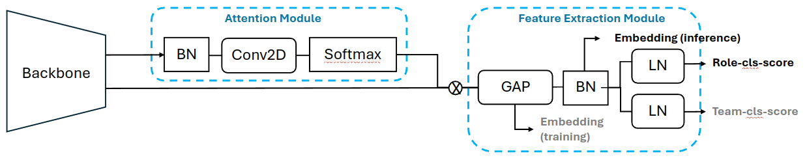

# Team Affiliation Model
Repo of Team-Affiliation and Position-classification model.
This task is related with metric learning and unsupervised learning.
You have to use KMeans algorithm for clustering with representation made by this model.



## Dependencies
* [PyTorch](https://pytorch.org)
* [CUDA](https://developer.nvidia.com/cuda-downloads)
* [cuDNN](https://developer.nvidia.com/cudnn)
* [Anaconda](https://www.anaconda.com/download/)

## Installation
Install Python packages

```shell
pip install -r requirements.txt
```

## Usage
### Train
```shell
# example1: python3 train.py --config_file config/config-icehockey.yaml
# example2: python3 train.py --config_file config/config-soccernetgs.yaml --checkpoint save/IceHockey/prtrei_resnet18_checkpoint_80.tar
python3 train.py --config_file [CONFIG_FILE_PATH] --checkpoint [CHECKPOINT_PATH] 
```

### Train (Role-Classifier Layer)
```shell
# python3 train_role_cls.py --config_file config/config-role-cls.yaml --checkpoint save/SoccerNetGS/prtrei_resnet18_checkpoint_80.tar
python3 train_role_cls.py --config_file [CONFIG_FILE_PATH] --checkpoint [CHECKPOINT_PATH]
```

### Eval


### Demo (+with KMeans Clustering)
```shell
# python3 test_with_cluster.py --config_file config/config-test.yaml --checkpoint save/SoccerNetGS/prtrei_resnet18_checkpoint_80.tar --dataset Hockey
python3 test_with_cluster.py --config_file [CONFIG_FILE_PATH] --checkpoint [CHECKPOINT_PATH] 
```

## Soon...
* Evaluation code